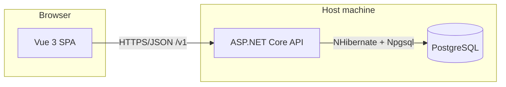

# Expense Tracker

A full-stack personal finance application for tracking income and expenses, managing accounts and categories, setting budgets and goals, and viewing a dashboard—all behind JWT-based authentication.

---

## 1. Product scope

### Purpose

Help users record and organize money movement across multiple accounts and currencies, categorize transactions, plan spending with budgets, and track savings goals in one place.

### Core capabilities

| Area | What users can do |
|------|-------------------|
| **Identity** | Register, log in, refresh tokens, password reset flows; optional social-style auth hooks in the API. |
| **Accounts** | Create accounts tied to account types and currencies; opening balance, savings flag, net-worth inclusion. |
| **Money types** | Manage currencies and custom account types (e.g. bank, card). |
| **Categories** | Income, expense, and targeted-savings-goal categories; subcategories under categories. |
| **Transactions** | Record amounts, dates, descriptions, account, category, optional subcategory. |
| **Budgets** | Per-category budgets with effective date ranges and active flag. |
| **Goals** | Financial goals linked to categories, with target/current amounts, dates, status, and priority. |
| **Dashboard** | Aggregated views (spending, income, trends) driven by transaction and category data. |
| **Profile** | User profile and preferences aligned with the user model in the API. |

### Out of scope (typical)

- Bank feed / automatic import (unless added later).
- Multi-tenant SaaS billing and org management.
- Mobile native apps (this repo is web + API).

---

## 2. System architecture



- **Frontend:** Single-page application; all business UI calls go to the REST API under `/v1/`.
- **Backend:** Stateless API (JWT access + refresh); persistence through NHibernate to PostgreSQL.
- **Database:** Relational schema defined in `ExpenseTrackerAPI/scripts/init-schema.sql` (run once per database).

---

## 3. Technology stack

### Backend (`ExpenseTrackerAPI/`)

| Layer | Technology |
|-------|------------|
| Runtime | .NET 8 |
| Web | ASP.NET Core Web API |
| ORM | NHibernate (XML mappings, PostgreSQL dialect) |
| Database | PostgreSQL 15+ |
| Auth | JWT Bearer (access + refresh token storage) |
| Validation | FluentValidation |
| API docs | Swagger / OpenAPI (development) |

### Frontend (`ExpenseTrackerUI/`)

| Layer | Technology |
|-------|------------|
| Framework | Vue 3 (Composition API where used) |
| Language | TypeScript |
| UI | Vuetify 3 |
| Build / dev | Vite 5 |
| State | Pinia |
| Routing | Vue Router |
| HTTP | Axios |

### Data store

- **Engine:** PostgreSQL.
- **Schema:** One script: `ExpenseTrackerAPI/scripts/init-schema.sql` (idempotent `CREATE IF NOT EXISTS` / safe `ALTER` where applicable).
- **Main entities:** users, currencies, account_types, accounts, categories, sub_categories, transactions, budgets, goals, refresh_tokens, password_reset_tokens, plus reference table `category_types`.

---

## 4. Repository layout

```
ExpenseTracker/
├── README.md                          # This file (single project doc)
├── ExpenseTrackerAPI/
│   ├── ExpenseTracker.sln
│   ├── scripts/
│   │   └── init-schema.sql            # Database schema (apply once per DB)
│   └── src/
│       ├── ExpenseTracker.API/        # HTTP entry: controllers, Program.cs, appsettings
│       ├── ExpenseTracker.Service/    # Business logic and auth services
│       ├── ExpenseTracker.Repository/ # NHibernate repositories and *.hbm.xml mappings
│       └── ExpenseTracker.Dtos/       # Request/response and shared models
└── ExpenseTrackerUI/
    ├── package.json
    ├── vite.config.ts
    ├── .env                           # VITE_API_BASE (and other Vite env vars)
    └── src/
        ├── components/
        ├── views/
        ├── stores/
        ├── services/                  # API client usage (e.g. apiService.ts)
        └── lib/                       # Shared utilities / API helpers
```

---

## 5. API conventions

- **Base path:** `/v1/` (e.g. health: `GET /v1/health`).
- **Auth:** Protected routes expect `Authorization: Bearer <access_token>`; refresh and login endpoints issue tokens.
- **CORS:** In Development, localhost and private LAN ranges (e.g. `192.168.x.x`) are allowed for browser clients.
- **Configuration:** Connection string resolution order in code: environment variable `CONNECTION_STRING`, then `ConnectionStrings:DefaultConnection`, then a built-in fallback. See `Program.cs`.

---

## 6. Getting started

### Prerequisites

- [.NET 8 SDK](https://dotnet.microsoft.com/download)
- [Node.js 18+](https://nodejs.org/)
- [PostgreSQL 15+](https://www.postgresql.org/download/)

### 6.1 Database

1. Ensure PostgreSQL is running.
2. Use a database that matches `ExpenseTrackerAPI/src/ExpenseTracker.API/appsettings.json` (default in repo: `Database=postgres`, user often your OS username on Homebrew macOS).
3. Apply the schema once:

```bash
psql -d postgres -f ExpenseTrackerAPI/scripts/init-schema.sql
```

Use `-U <username>` if your superuser is not the default. Use a different `-d` database name if you changed the connection string.

### 6.2 Backend API

From the solution root or API project folder:

```bash
cd ExpenseTrackerAPI/src/ExpenseTracker.API
dotnet restore
dotnet run
```

Or open `ExpenseTracker.sln` in **JetBrains Rider** or **Visual Studio** and run the **ExpenseTracker.API** project.

- **Launch profile:** `Properties/launchSettings.json` profile `ExpenseTracker.API` uses `http://localhost:5001` for the browser and `ASPNETCORE_URLS=http://0.0.0.0:5001` so the API is also reachable on your LAN IP (same port).

### 6.3 Frontend

```bash
cd ExpenseTrackerUI
npm install
npm run dev
```

Open the URL Vite prints (commonly `http://localhost:5173`).

Set `VITE_API_BASE` in `.env` to your API root including `/v1/`, for example:

```env
VITE_API_BASE=http://localhost:5001/v1/
```

Restart `npm run dev` after changing `.env`.

### 6.4 LAN access (optional)

- API: already listens on `0.0.0.0:5001` when using the default launch profile.
- Frontend: use `npm run dev:network` (see `package.json`) so Vite binds to all interfaces and uses the LAN IP for `VITE_API_BASE` as configured there. Other devices open `http://<your-host-ip>:5173`.

---

## 7. Configuration reference

| Concern | Location |
|---------|----------|
| API → PostgreSQL | `ExpenseTrackerAPI/src/ExpenseTracker.API/appsettings.json` (`ConnectionStrings:DefaultConnection`, `CONNECTION_STRING`) |
| Override at runtime | Environment variable `CONNECTION_STRING` |
| Frontend → API base URL | `ExpenseTrackerUI/.env` → `VITE_API_BASE` |
| JWT / email (production) | `appsettings.json` / `appsettings.Production.json`; prefer secrets and env vars for production |

---

## 8. Troubleshooting

| Symptom | Likely fix |
|---------|------------|
| `FATAL: role "postgres" does not exist` | On Homebrew PostgreSQL, default superuser is your Mac username; align `Username` in `appsettings.json`. |
| Column or table missing | Run `init-schema.sql` on the **same** database name as in the connection string. |
| Browser cannot call API | Match `VITE_API_BASE` to the scheme, host, port, and `/v1/` path; check CORS if using a non-localhost origin. |
| Rider “profile not found” / bad run config | Run configuration → launch profile **ExpenseTracker.API**; recreate the .NET run configuration if it still references a removed profile. |

---

## 9. License

MIT.
